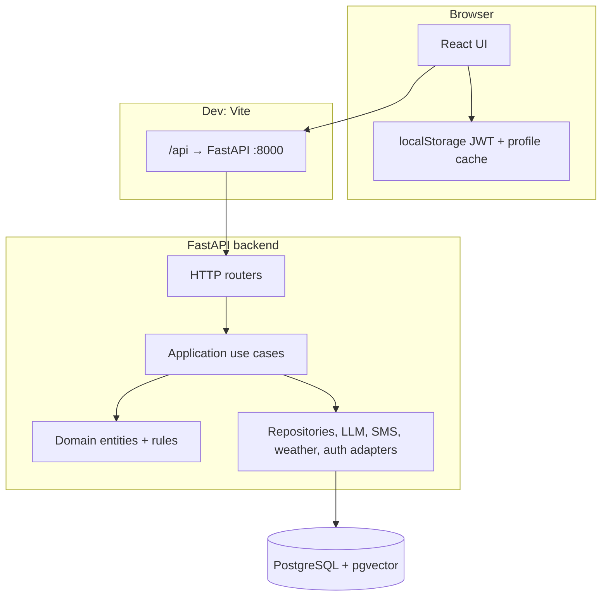
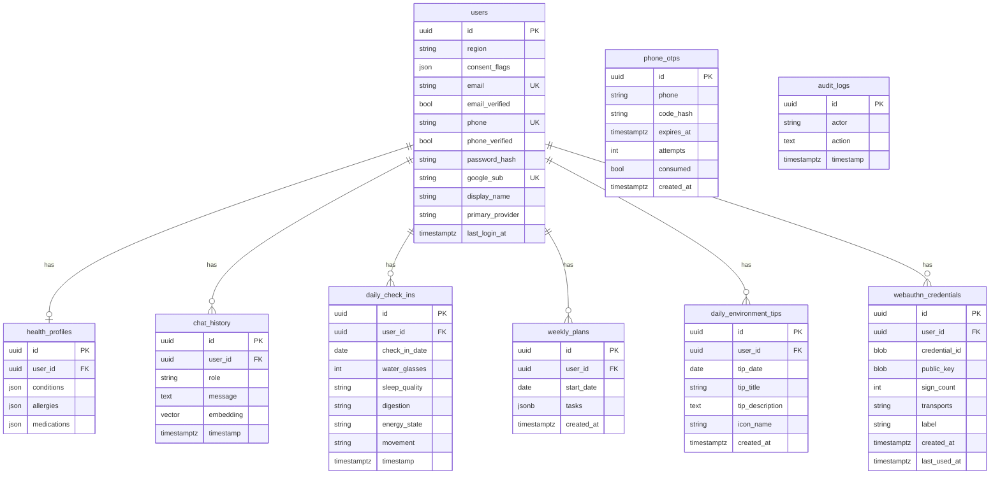

# AtharvAyur / HolisticAI Health — Developer Guide

Reference document for **architecture**, **module layout**, **HTTP API**, and **database schema**. Code paths are relative to the repository root `GitCode/AtharvAyur/` unless noted.

---

## 1. Executive overview

| Layer | Technology |
|--------|------------|
| Frontend | React 18, Vite 5, Tailwind CSS, i18next (EN/HI), Vitest |
| Backend | Python 3.12+, FastAPI, SQLAlchemy 2, Alembic |
| Database | PostgreSQL 14+ with **pgvector** extension |
| Auth | JWT (Bearer), email/password, phone OTP, Google ID token, WebAuthn passkeys |
| LLM | Configurable: Google Gemini (default) or Groq (`app/config.py`) |

The frontend talks to the API **via HTTP**. In local development, Vite proxies `/api/*` → `http://127.0.0.1:8000/*` (see `vite.config.js`). The browser therefore uses relative URLs such as `/api/auth/login/email`.

---

## 2. High-level architecture



**Dependency direction:** `interfaces/http` → `application` → `domain` ← `infrastructure` (infrastructure implements ports defined in `application/ports`).

---

## 3. Repository layout

### 3.1 Frontend (`src/`)

| Area | Responsibility |
|------|----------------|
| `App.jsx` | Routes unauthenticated → auth screen vs quiz vs chat shell based on `AuthContext` |
| `containers/` | Composition: wire viewmodels + services + context |
| `views/` | Presentational JSX (forms, chat, quiz, plans, check-ins) |
| `viewmodels/` | Hooks (`use*ViewModel`, `useAuthProvider`) — state and orchestration |
| `services/` | `apiClient`, `authService`, `chatService`, `profileService`, etc. |
| `models/` | Pure helpers (quiz scoring, profile payload, credentials, citations) |
| `i18n/` | Translations + language toggle |
| `utils/` | Small shared helpers (e.g. Google sign-in env flags) |

### 3.2 Backend (`backend/app/`)

| Package | Responsibility |
|---------|----------------|
| `domain/` | Entities, value objects (`Email`, `PhoneE164`), domain services, errors — **no** FastAPI/SQLAlchemy |
| `application/` | Use cases (commands/queries), DTOs, **ports** (Protocols) for repos, LLM, tokens, etc. |
| `infrastructure/` | SQLAlchemy repos, bcrypt/JOSE/Google/WebAuthn/LLM/weather/SMS adapters |
| `interfaces/http/` | FastAPI routers, Pydantic schemas, `deps.py` (dependency injection wiring), exception handlers |
| `models/` | SQLAlchemy ORM models (`User`, `HealthProfile`, `ChatHistory`, …) |
| `config.py` | `pydantic-settings` — env-driven configuration |
| `database.py` | Engine, session factory, `Base` |
| `main.py` | App factory: CORS, routers, `/health`, lifespan (scheduler) |
| `scheduler.py` | APScheduler cron jobs (e.g. weekly plan batch for users) |

---

## 4. Backend module design (layers)

### 4.1 Domain (`app/domain/`)

- **Entities**: `User`, `HealthProfile`, `ChatTurn`, `DailyCheckIn`, `WeeklyPlan`, `PhoneOtp`, `WebAuthnCredential`, …
- **Value objects**: `Email`, `PhoneE164`, enums (`AuthProvider`, `Dosha`, …)
- **Domain services**: e.g. `profile_merge`, `safety_policy`, `plan_normalization`, `weather_interpretation`
- **Errors**: `AuthenticationError`, `ValidationError`, `NotFoundError`, …

Business rules that should survive a change of framework belong here.

### 4.2 Application (`app/application/`)

- **`use_cases/`**: One class per workflow (`SignUpWithEmail`, `GenerateHealthReply`, `UpsertProfile`, …). Each receives ports via constructor or factory in `deps.py`.
- **`ports/`**: Abstract interfaces (`UserRepository`, `LLMGateway`, `TokenService`, …).
- **`dtos.py`**: Input/output shapes crossing the application boundary.

### 4.3 Infrastructure (`app/infrastructure/`)

Concrete implementations: `SqlAlchemyUserRepository`, `GeminiGateway`, `GroqGateway`, `JoseTokenService`, `BcryptPasswordHasher`, `StubSmsSender`, `OpenWeatherWeatherGateway`, etc.

### 4.4 HTTP interface (`app/interfaces/http/`)

- **`routers/`**: Thin controllers — validate body, call use case, map to response schema.
- **`deps.py`**: Builds use cases with real adapters (single composition root for HTTP).
- **`schemas/`**: Pydantic request/response models.

---

## 5. Frontend module design

### 5.1 Authentication flow

- **`useAuthProvider`** (`viewmodels/useAuthProvider.js`): Holds `user`, `hasProfile`, `profileChecked`; `handleSession` after login/signup; `hasHealthProfile()` → `/profile/me`; optional loading timeout for stuck profile checks.
- **`AuthScreenContainer`**: Login/signup VMs → `handleSession`.
- **`authService.js`**: `/auth/*`, persists JWT + minimal user to `storage.js`.
- **`apiClient.js`**: Base URL (`VITE_API_URL` or `/api` prefix), `Authorization` header, error formatting.

### 5.2 Feature areas

| Feature | Typical container | Service |
|---------|-------------------|---------|
| Dosha quiz | `QuizContainer` | `profileService` |
| Chat | `HealthChatContainer` | `chatService`, `sessionService` |
| Daily check-in | `DailyCheckInContainer` | `checkinService` |
| Weekly plan | `WeeklyPlanContainer` | `planService` |
| Environment tip | `DailyEnvironmentTipContainer` | `environmentService` |
| Passkeys | `SecuritySettingsContainer` | `webauthnService` |

---

## 6. HTTP API summary

Base path in production may vary; paths below are **FastAPI route paths** (after proxy rewrite they are mounted at `/api/...` from the browser if using default Vite proxy).

### 6.1 Auth (`interfaces/http/routers/auth.py`)

| Method | Path | Notes |
|--------|------|--------|
| POST | `/auth/token` | Issue anonymous JWT (legacy quiz-first flow) |
| POST | `/auth/signup/email` | Register with email/password |
| POST | `/auth/login/email` | Email/password session |
| POST | `/auth/phone/request-otp` | SMS OTP (stub sender in dev; dev OTP may be exposed via config) |
| POST | `/auth/phone/verify-otp` | Complete phone login/signup |
| POST | `/auth/google` | Google ID token |
| POST | `/auth/webauthn/register/options` | Authenticated — register passkey |
| POST | `/auth/webauthn/register/verify` | Finish registration |
| POST | `/auth/webauthn/login/options` | Begin passkey login |
| POST | `/auth/webauthn/login/verify` | Finish passkey login → session |
| GET | `/auth/me` | Current user profile (Bearer required) |

### 6.2 Profile (`profile.py`)

| Method | Path | Notes |
|--------|------|--------|
| POST | `/profile` | Create/update health profile (quiz payload) |
| GET | `/profile/me` | Profile + nested health profile |

### 6.3 Chat (`chat.py`)

| Method | Path | Notes |
|--------|------|--------|
| POST | `/chat` | User message → LLM reply; persists turns; semantic recall via embeddings |

### 6.4 Check-in & plan & environment

| Method | Path | Notes |
|--------|------|--------|
| GET | `/checkin/week` | Week window of daily check-ins |
| POST | `/checkin` | Upsert daily check-in |
| POST | `/environment/daily-tip` | Cached daily environment tip (weather-driven) |
| POST | `/plan/generate` | Generate weekly plan |
| GET | `/plan/current` | Current week plan |
| PUT | `/plan/task` | Toggle/update task |

### 6.5 Health probe

| Method | Path |
|--------|------|
| GET | `/health` |

---

## 7. Database schema

PostgreSQL database name in Docker compose is typically `holistica_health` (see `backend/docker-compose.yml`). All application tables use UUID primary keys unless noted.

### 7.1 Entity relationship (conceptual)



### 7.2 Tables (reference)

#### `users`

| Column | Type | Notes |
|--------|------|--------|
| `id` | UUID | PK |
| `region` | VARCHAR(255) | Optional |
| `consent_flags` | JSON | Optional |
| `email` | VARCHAR(320) | Nullable, **unique** |
| `email_verified` | BOOLEAN | Default false |
| `phone` | VARCHAR(32) | E.164 stored as string; **unique** |
| `phone_verified` | BOOLEAN | Default false |
| `password_hash` | VARCHAR(255) | Nullable (OAuth-only users) |
| `google_sub` | VARCHAR(128) | Nullable, **unique** |
| `display_name` | VARCHAR(255) | Nullable |
| `primary_provider` | VARCHAR(32) | e.g. `anonymous`, `password`, `google`, `phone`, `passkey` |
| `last_login_at` | TIMESTAMPTZ | Nullable |

Indexes: `email`, `phone`, `google_sub` (see migration `20260421_0006`).

#### `health_profiles`

| Column | Type | Notes |
|--------|------|--------|
| `id` | UUID | PK |
| `user_id` | UUID | FK → `users.id` ON DELETE CASCADE, **unique** |
| `conditions`, `allergies`, `medications` | JSON | Nullable |

One profile row per user (enforced by unique `user_id`).

#### `chat_history`

| Column | Type | Notes |
|--------|------|--------|
| `id` | UUID | PK |
| `user_id` | UUID | FK → `users.id` ON DELETE CASCADE |
| `role` | VARCHAR | `user` / `assistant` |
| `message` | TEXT | |
| `timestamp` | TIMESTAMPTZ | Indexed |
| `embedding` | `vector(768)` | pgvector; IVFFlat index for similarity |

#### `daily_check_ins`

| Column | Type | Notes |
|--------|------|--------|
| `id` | UUID | PK |
| `user_id` | UUID | FK → `users.id` ON DELETE CASCADE |
| `check_in_date` | DATE | |
| `water_glasses` | INTEGER | |
| `sleep_quality`, `digestion`, `energy_state`, `movement` | VARCHAR(32) | Ayurvedic-style fields |
| `timestamp` | TIMESTAMPTZ | |

**Unique:** (`user_id`, `check_in_date`).

#### `weekly_plans`

| Column | Type | Notes |
|--------|------|--------|
| `id` | UUID | PK |
| `user_id` | UUID | FK → `users.id` ON DELETE CASCADE |
| `start_date` | DATE | Week anchor |
| `tasks` | JSONB | |
| `created_at` | TIMESTAMPTZ | |

**Unique:** (`user_id`, `start_date`).

#### `daily_environment_tips`

| Column | Type | Notes |
|--------|------|--------|
| `id` | UUID | PK |
| `user_id` | UUID | FK → `users.id` ON DELETE CASCADE |
| `tip_date` | DATE | |
| `tip_title` | VARCHAR(512) | |
| `tip_description` | TEXT | |
| `icon_name` | VARCHAR(64) | |
| `created_at` | TIMESTAMPTZ | |

**Unique:** (`user_id`, `tip_date`).

#### `webauthn_credentials`

| Column | Type | Notes |
|--------|------|--------|
| `id` | UUID | PK |
| `user_id` | UUID | FK → `users.id` ON DELETE CASCADE |
| `credential_id` | BYTEA | **unique** |
| `public_key` | BYTEA | |
| `sign_count` | INTEGER | |
| `transports`, `label` | VARCHAR | Optional |
| `created_at`, `last_used_at` | TIMESTAMPTZ | |

#### `phone_otps`

Stores hashed OTP challenges for phone verification. **No FK to users** — linkage is by normalized phone string at verify time.

| Column | Type | Notes |
|--------|------|--------|
| `id` | UUID | PK |
| `phone` | VARCHAR(32) | |
| `code_hash` | VARCHAR(128) | |
| `expires_at` | TIMESTAMPTZ | |
| `attempts` | INTEGER | |
| `consumed` | BOOLEAN | |
| `created_at` | TIMESTAMPTZ | |

#### `audit_logs`

Append-only audit trail (`actor`, `action`, `timestamp`). No FK to `users` — `actor` is a string (often user id or phone).

### 7.3 Migrations

Alembic revisions live in `backend/alembic/versions/`:

| Revision | Summary |
|----------|---------|
| `20260330_0001` | Initial: `users`, `health_profiles`, `chat_history`, `audit_logs` |
| `20260331_0002` | `chat_history.embedding` + pgvector index |
| `20260402_0003` | `daily_check_ins`, `weekly_plans` |
| `20260403_0004` | Ayurvedic biomarkers on check-ins; removes legacy mood/diet/exercise columns |
| `20260404_0005` | `daily_environment_tips` |
| `20260421_0006` | Identity columns on `users`, `webauthn_credentials`, `phone_otps` |

Apply with: `cd backend && .venv/bin/alembic upgrade head` (or `npm run db:migrate` from frontend root).

---

## 8. Background jobs

`app/scheduler.py` registers APScheduler jobs at application startup (see `main.py` lifespan). Notably, a **cron** job can run **`GenerateWeeklyPlansForAllUsers`** when the LLM gateway is configured — intended for batch weekly plan generation in deployed environments.

---

## 9. Configuration (quick reference)

| Concern | Frontend | Backend |
|---------|-----------|---------|
| API base URL | `VITE_API_URL` or default `/api` proxy | N/A |
| Google button | `VITE_ENABLE_GOOGLE_SIGNIN`, `VITE_GOOGLE_CLIENT_ID` | `GOOGLE_CLIENT_ID` (token verify) |
| Phone normalization | `VITE_PHONE_DEFAULT_COUNTRY_CODE` | — |
| Database | — | `DATABASE_URL` in `backend/.env` |
| JWT | — | `JWT_SECRET_KEY`, algorithm |
| CORS | — | `CORS_ORIGINS` |
| LLM | — | `LLM_PROVIDER`, `GEMINI_API_KEY` / `GROQ_API_KEY` |
| Dev OTP | — | `AUTH_EXPOSE_DEV_OTP` (see `config.py`) |

Copy from `backend/.env.example` and repo root `.env.example`.

---

## 10. Local development commands

From `GitCode/AtharvAyur/`:

```bash
npm install
cd backend && python3 -m venv .venv && .venv/bin/pip install -r requirements.txt
# Postgres up + migrations (Docker example)
npm run db:up
npm run db:migrate
# Frontend + API together
npm run dev:full
```

Open the URL printed by Vite (typically `http://localhost:5173`). API listens on `127.0.0.1:8000`; health check: `GET http://127.0.0.1:8000/health`.

---

## 11. Optional dev utilities

- **`backend/scripts/seed_default_user.py`**: Creates/resets a development email/password user (run only in trusted environments).

---

*Document generated to match the codebase layout and migrations as of the repository snapshot; after schema changes, update Alembic revisions and this section accordingly.*
